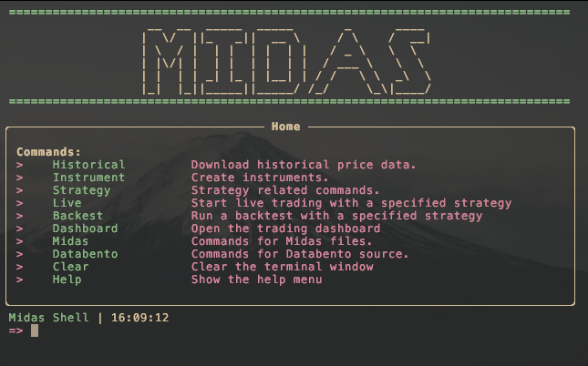

# Midas Shell

[](LICENSE)

## Overview

The Midas Shell is the central entry point for interacting with the Midas Trading System. Designed as a CLI/REPL tool, it provides comprehensive control over all system components, including backtesting, data ETL pipelines, file comparison, live trading, and launching the GUI dashboard.

### Key Capabilities:

1. **Backtesting**: Run backtests directly from the shell, provided the shell is launched within a Python virtual environment that has the `midastrader` library installed.
2. **ETL Pipelines**: Supports data ingestion from sources like Databento, with plans to expand to additional sources in the future.
3. **Midas Server Integration**: Push data directly to the `midas-server` for processing and visualization.
4. **GUI Integration**: Open the Midas Dashboard from the shell for a graphical view of the system.
5. **Live Trading**: Execute live trading strategies seamlessly.
6. **File Comparison**: Analyze and compare files encoded in the Midas binary format.

## Usage

The shell includes the following commands:

| **Command**  | **Description**                                |
| ------------ | ---------------------------------------------- |
| `Historical` | Download historical price data.                |
| `Instrument` | Create instruments in server database.         |
| `Strategy`   | List local strategies available for operation. |
| `Live`       | Start live trading with a specified strategy.  |
| `Backtest`   | Run a backtest with a specified strategy.      |
| `Dashboard`  | Open the midas-gui.                            |
| `Midas`      | Handles Midas binary encoded files.            |
| `Databento`  | ETL pipeline for Databento source.             |

## Screenshots

### Default



### Starship Toolbar


## Installation

1. Clone the repository:

   ```bash
   git clone https://github.com/midassystems/midas-shell.git
   cd midas-shell
   ```

2. Run the build script:

   ```bash
   ./scripts/build.sh
   ```

   - When prompted, select **Production**.

3. Navigate to the release directory:

   ```bash
   cd midas-release
   ```

4. Make the installer executable:

   ```bash
   chmod +x ./install.sh
   ```

5. Run the installer:
   ```bash
   ./install.sh
   ```

## Requirements

### Dependencies:

1. **Python Virtual Environment**:

   - The `midastrader` library is required, though it is not yet available on PyPI. You can install it from source:
     ```bash
     git clone https://github.com/midassystems/midastrader.git
     cd midastrader
     python setup.py install
     ```

2. **Starship Toolbar (Optional)**:

   - If you'd like to use the Starship toolbar for an enhanced experience:
     - Install Starship using Homebrew:
       ```bash
       brew install starship
       ```
     - A default Starship configuration (`midas_starship.toml`) ships with the tool, avoiding conflicts with other Starship configurations.

3. **Databento API Key**:

   - The ETL pipeline is currently configured to use Databento as a data source.
   - You will need to add your Databento API key to the configuration file (`~/.config/midas/config.toml`).

4. **Midas Server**:
   - The Midas Shell requires the [Midas Server](https://github.com/midassystems/midas-server) to be running. This can be deployed locally or remotely using Docker.

## Configuration

### Data Configuration

The application ships with a default configuration file (`config.toml`) located at `~/.config/midas/`. Users will need to edit this file to match their environment. Below is an example:

```toml
[common]
log_level = "info"
midas_url = "http://127.0.0.1:8080"
api_key = "api_key"

[vendors]
databento_key = "api_key"
```

- **Midas URL**: Update the `midas_url` based on where your `midas-server` is running.
- **Databento API Key**: You must acquire a free Databento API key from [Databento](https://databento.com) and add it to the `config.toml` file.

### Starship Toolbar Configuration (Optional)

A separate Starship configuration file (`midas_starship.toml`) is included and will be picked up automatically by the shell. Users can edit this file for customization as needed. It is located in the same directory as `config.toml`.

## License

This project is licensed under the Apache 2.0 License. See the [LICENSE](LICENSE) file for details.
